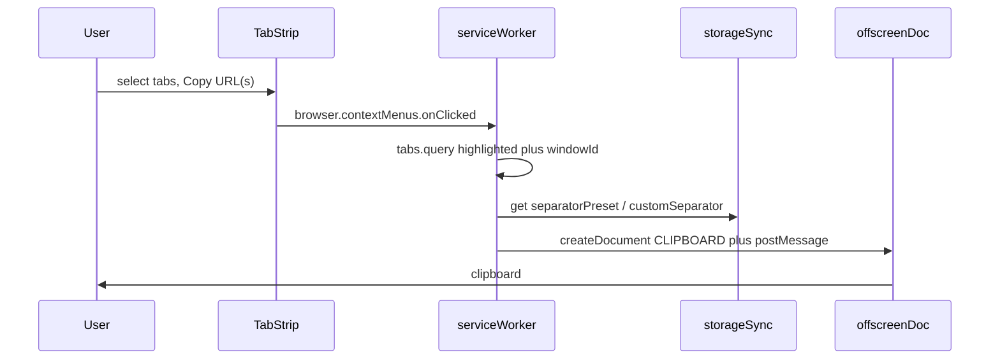
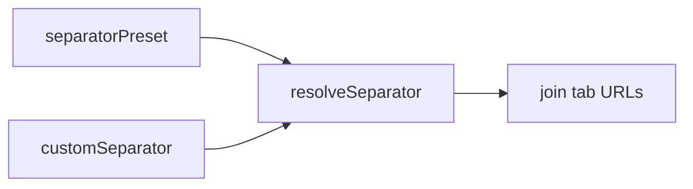

# Copy Tab URL(s)

Chrome extension (Manifest V3) that copies URLs of **selected tabs** from the tab strip context menu. Settings sync across signed-in Chrome profiles via `browser.storage.sync`.

Licensed under the [MIT License](./LICENSE).

Requires **Chrome 150+** (`contexts: ["tab"]`).

## What it does

1. Select one or more tabs (Shift/Cmd-click).
2. Right-click a selected tab in the tab strip.
3. Choose **Copy URL(s)**.
4. Paste: URLs joined with your saved separator.

The click callback receives only the tab that was right-clicked. The extension then queries every highlighted tab in that window.

## Separator

Presets: new line (default), space, comma, semicolon, or any custom string (including empty).

Open **Details → Extension options** (or right-click the extension → **Options**) to change this. Changes save immediately to `browser.storage.sync`.

## Local installation

1. Open Chrome → `chrome://extensions`
2. Enable **Developer mode**
3. Click **Load unpacked**
4. Select the `extension/` directory (or the linked worktree you are developing in)

## Permissions

| Permission | Why |
|------------|-----|
| `contextMenus` | Add **Copy URL(s)** to the tab strip menu |
| `tabs` | Read URLs of highlighted tabs |
| `storage` | Synced separator settings |
| `offscreen` | Hidden document for clipboard write |
| `clipboardWrite` | Copy joined URLs to the clipboard |

No `host_permissions`.

## Chrome Web Store listing assets

Store assets live in `images/store/` (not shipped in the extension zip):

- Screenshots (1280×800), in the upload order recommended in `store/listing-metadata.txt`: `screenshot-context-menu.png`, `screenshot-selected-tabs.png`, `screenshot-options.png`
- Small promo tile: `promo-small.png` (440×280)
- Marquee: `promo-marquee.png` (1400×560)

Listing copy lives in `store/`, one file per dashboard field, ready to paste verbatim:

| File | Dashboard field |
|------|-----------------|
| `name.txt` | Store listing → Item name |
| `summary.txt` | Store listing → Summary (132 char limit) |
| `description.txt` | Store listing → Description |
| `listing-metadata.txt` | Category, language, URLs, asset mapping |
| `single-purpose.txt` | Privacy practices → Single purpose |
| `permission-justifications.txt` | Privacy practices → per-permission and remote code |
| `data-usage.txt` | Privacy practices → data collection and certifications |
| `privacy-policy.txt` | Text to publish, then link as Privacy policy URL |

## Chrome Web Store release

semantic-release https://github.com/semantic-release/semantic-release versions from Conventional Commits https://www.conventionalcommits.org/ on `main`. A release:

1. Bumps `extension/manifest.json` / `package.json`
2. Builds `copy-tab-urls.zip` with **runtime files only** (`scripts/pack-extension.sh`)
3. Attaches that zip to the GitHub Release (in addition to GitHub’s source archives)
4. Uploads the **same** zip to the Chrome Web Store as a draft

Setup:

1. Enable the Chrome Web Store API https://developer.chrome.com/docs/webstore/using_webstore_api and create OAuth credentials.
2. Upload an initial draft in the developer dashboard https://chrome.google.com/webstore/devconsole once to obtain the 32-character extension ID.
3. Add GitHub Actions secrets `CHROME_WEB_STORE_CLIENT_ID`, `CHROME_WEB_STORE_CLIENT_SECRET`, `CHROME_WEB_STORE_REFRESH_TOKEN`, and repository variable `CHROME_EXTENSION_ID`.
4. Merge releasable commits to `main` (or run **Actions → Publish to Chrome Web Store → Run workflow**).

Tag pushes use `upload` (draft in the developer console; you publish manually). Uses mobilefirstllc/cws-publish https://github.com/marketplace/actions/publish-chrome-extension-to-chrome-web-store.

The publish job fails until those secrets and the extension ID exist. The GitHub Release zip is still created by the release job.

## Repository layout

| Path | Purpose |
|------|---------|
| `extension/` | Manifest V3 runtime (manifest, JS, HTML, CSS, icons) loaded by Chrome and packed into `copy-tab-urls.zip` |
| `images/` | README and Chrome Web Store screenshots |
| `store/` | Chrome Web Store listing copy (not shipped in the zip) |
| `scripts/` | Release packaging helpers |

## Development notes

- Pure JavaScript — no TypeScript, no bundler.
- Clipboard write uses an offscreen document and `document.execCommand('copy')`.
- Manual checks: [TESTPLAN.md](./TESTPLAN.md)
